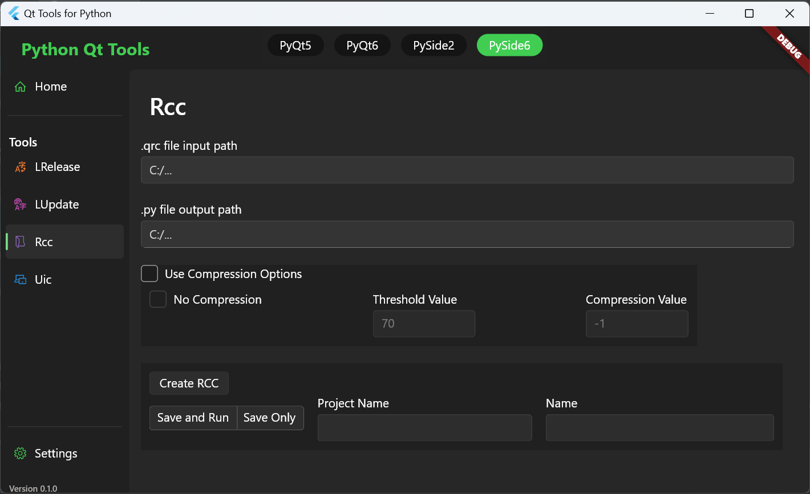

# Qt Python Tools

A desktop Flutter application for easily creating, running and saving terminal commands when using Qt tools for Python.



### Tools

Supported Qt tools include:
- uic
- rcc

Future Tools
- lupdate
- lrelease

### Python

Supported Python Qt implementations:

- PyQt5
- PyQt6
  - [rcc support has been removed by pyqt dev](https://www.riverbankcomputing.com/pipermail/pyqt/2020-September/043210.html)
- PySide2
- PySide6

## Usage

Run the program, go to settings and set the paths to the `scripts/` folder where the tools are located and save the settings.

You can also set your preferred version on the same page.

Use the Navigation Pane to select your tool, add the information and click run.

You can also supply a name and save the command to run again at another time from the 'Home' page.

## Installation
### Windows
Program is developed and fully tested on Windows.

For a release sqlite3.dll should be included in the application folder. [Link](https://pub.dev/packages/sqflite_common_ffi)

### Linux
**The program launches but is untested.**

libsqlite3.so needs to be installed.

In my default Ubuntu installation, it was not available (but .so.0 & .so.0.8.6 were).
It was expected to be found in: ```/usr/lib/x86_64-linux-gnu/```

To install run the command:
```sudo apt-get -y install libsqlite3-0 libsqlite3-dev```

## Libraries
 - [Fluent UI for Flutter](https://github.com/bdlukaa/fluent_ui)
 - [SyncFusion](https://pub.dev/packages/syncfusion_flutter_datagrid)